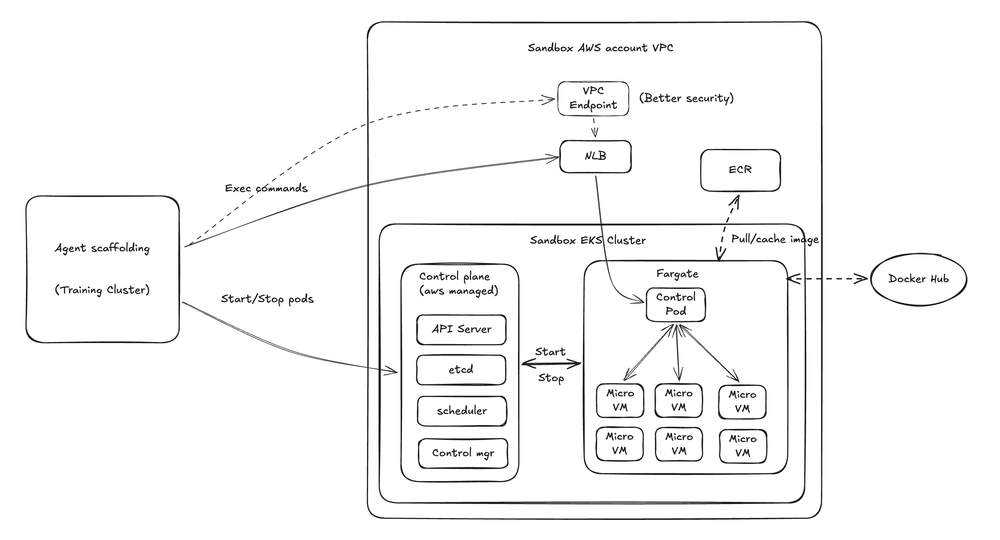

# harbor-aws

[](LICENSE)

AWS EKS/Fargate execution backend for [Harbor](https://github.com/harbor-framework/harbor) benchmarks. Run thousands of sandbox trials in parallel with per-second billing and VM-level isolation.

## System Overview



## Main Bottleneck

The main bottleneck of running Harbor benchmarks on AWS EKS Fargate is using Kubernetes `exec` as the command execution path. As concurrency grows, the EKS control plane can become the limiting factor instead of the underlying Fargate compute capacity.

## Solution

Harbor-aws exposes an in-cluster Harbor control service through a Network Load Balancer. The control service maintains long-lived connections with the trial pods. Benchmark commands are sent to the control service and then forwarded to the target pod without going through the AWS-managed Kubernetes control plane.

## Install

```bash
pip install "harbor-aws[cdk]"
```

## Quick start

### 1. Deploy (~15 min, one-time)

```bash
python -m harbor_aws deploy --region us-east-1
```

Creates everything: VPC, EKS, control pod Deployment, NLB, Load Balancer Controller. Prints the `HARBOR_NLB_URL` and `HARBOR_BEARER_TOKEN` values to copy into step 2.

### 2. Run benchmarks

```bash
export HARBOR_NLB_URL=http://<nlb-dns>:8443
export HARBOR_BEARER_TOKEN=<bearer-token>

# Example: terminal-bench with terminus-2 + Sonnet 4.6 via Bedrock, 89 concurrent trials.
harbor jobs start --task-git-url https://github.com/laude-institute/terminal-bench \
  -a terminus-2 -m bedrock/us.anthropic.claude-sonnet-4-6-v1:0 \
  --environment-import-path harbor_aws.adapter:AWSEnvironment \
  --ek stack_name=harbor-aws --ek ecr_cache=true \
  -n 89 --max-retries 2
```

### 3. Clean up

```bash
python -m harbor_aws stop      # delete trial pods, keep infra
python -m harbor_aws destroy   # tear down everything
```

## Development

```bash
pip install -e ".[dev,cdk]"
ruff check src/
mypy src/
```

## License

Apache License 2.0 — see [LICENSE](LICENSE).
